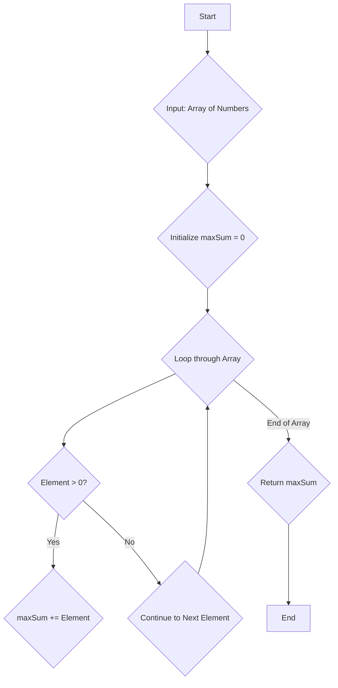

```mermaid
graph TD
    A[Start] --> B{Input: Array of Numbers};
    B --> C{Initialize maxSum = 0};
    C --> D{Loop through Array};
    D --> E{Element > 0?};
    E -- Yes --> F{maxSum += Element};
    E -- No --> G{Continue to Next Element};
    G --> D;
    D -- End of Array --> H{Return maxSum};
    H --> I[End];
```